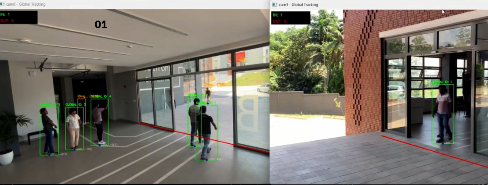
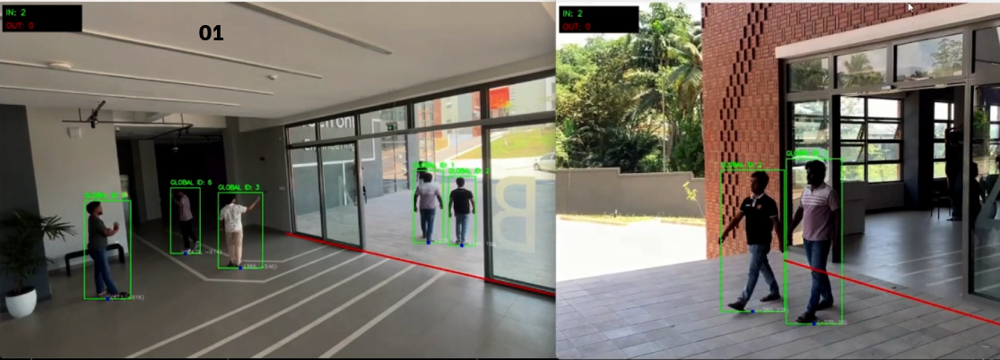

# Crowd Estimation for Disaster Recovery

Real-time multi-camera crowd monitoring with global ID tracking, door line counting, and panic detection.

<div align="center">
  
# 🚨 Crowd Estimation for Disaster Recovery
**A Real-Time System for Crowd Monitoring Using Machine Learning**

[](https://www.python.org/)
[](https://ultralytics.com/)
[](https://pytorch.org/)
[](https://opencv.org/)
[](https://opensource.org/licenses/MIT)

</div>

---

## 📌 Overview
During natural disasters or emergencies (like fires), first responders often operate blind, struggling to assess exactly how many people are trapped inside a building and what they look like. 

This project provides an **intelligent real-time building safety monitoring system** that combines computer vision, crowd analytics, and panic detection. By utilizing existing CCTV cameras, the system counts people, detects panic behavior based on crowd velocity, and generates actionable visual descriptions of individuals inside to help emergency responders allocate resources quickly and conduct accurate rescue operations.

### Key Capabilities:
* **Zero New Hardware:** Runs entirely on existing angled CCTV cameras.
* **Occlusion-Proof Counting:** Fuses multi-camera views to guarantee unique global counts without double-counting.
* **Automated Threat Awareness:** Detects sudden crowd panic and triggers instant alerts.
* **Survivor Profiling:** Instantly generates clothing profiles using Vision-Language Models to help locate trapped individuals.

---

## 🎯 Objectives
1. **Real-time People Counting:** Automatically detect and count individuals entering and exiting buildings using multiple side-angle cameras.
2. **Panic Detection:** Identify abnormal crowd movement patterns (rushing, sudden surges) to trigger early emergency alerts.
3. **Person Attribute Extraction:** Generate brief visual descriptions (e.g., clothing colors/types) to help identify people during rescues.
4. **Centralized Monitoring Dashboard:** A unified interface showing building occupancy, panic alerts, and occupant descriptions.

---

## 🧠 Key Modules

### 1. Global Tracking & Counting 🧍‍♂️
* **Detection & Tracking:** Uses **YOLOv8** coupled with **BoT-SORT / ByteTrack**. It utilizes a **Kalman Filter** to predict movement, ensuring stable tracking even when people temporarily walk behind obstacles.
* **Homography Spatial Mapping:** Transforms distorted, angled camera pixels into an exact $(X, Y)$ coordinate mapped to a 2D digital twin floor plan in real centimeters.
* **Virtual Line Counting:** Uses custom virtual lines with jitter-rejection (5.0s cooldown) and duplicate checks to accurately update Global IN/OUT states.

### 2. Cross-Camera Re-Identification (Re-ID) 🔍
* **Embedding Extraction:** Uses **OSNet** to extract a 512-dimensional 'digital fingerprint' based on clothing and textures.
* **Lighting Normalization:** Applies an 8x8 **CLAHE** grid exclusively to the Lightness (L) layer in the LAB color space, acting as a "digital flash" to balance dark shadows without washing out clothing colors.
* **Inside-Only Registry:** When a person exits, their embedding is matched and removed from the database, ensuring responders only see people actively trapped inside.

#### 👁️ Occlusion Handling & Re-ID in Action
The system guarantees unique global counts by bridging occlusions and cross-camera blind spots using OSNet embeddings and spatial logic.

<table align="center">
  <tr>
    <th align="center">Before Occlusion (Tracking)</th>
    <th align="center">After Occlusion (ID Restored)</th>
  </tr>
  <tr>
    <td align="center"></td>
    <td align="center"></td>
  </tr>
  <tr>
    <td align="center"><em>Person (ID: 2) tracked normally before passing behind a solid obstacle.</em></td>
    <td align="center"><em>Person (ID: 2) emerges. The Fusion Node successfully matches the embedding and restores the ID.</em></td>
  </tr>
</table>

💡**Notice the IDs:** As clearly seen in the images above, the system successfully maintains the exact same Global IDs (ID 1 and ID 2) for each person, even after they have been temporarily hidden by the pillar.

### 3. Behavioral Panic Detection 🏃💨
* **Velocity Calculation:** Calculates real-time speed using distance over time ($D / \Delta T$) derived from the digital twin map.
* **Ambient Baseline Learning:** Does not use hard-coded speed limits. Instead, it learns the normal ambient speed distribution (Gaussian curve) of a specific room.
* **Mass Panic Rule:** To prevent false alarms (e.g., one person running for an elevator), an emergency is **only triggered if >25% of the room's occupants suddenly cross the outlier threshold.**

### 4. AI Profiling & Occupant Registry 📝
* Uses the **Gemini Vision API / Qwen-VL** to generate textual descriptions of occupants (e.g., *"Red jacket, dark jeans, carrying a black backpack"*).
* Packages this data into an Actionable JSON Occupant Registry synced with the live Dashboard.

---

## 💻 Tech Stack

| Category | Technologies Used |
| :--- | :--- |
| **Core AI Models** | YOLOv8, OSNet (torchreid), Qwen-VL / Gemini |
| **Tracking Algorithms** | BoT-SORT, ByteTrack (Kalman Filter) |
| **Image & Spatial Processing** | OpenCV, CLAHE, RANSAC Homography Matrix |
| **Programming & Data** | Python 3.10, PyTorch, NumPy, Pandas, JSON, YAML |
| **User Interface** | Tkinter Dashboard |

---

## 🚀 Future Improvements
* **Edge Deployment:** Quantize and compress models (e.g., using TensorRT) to run directly on smart CCTV cameras to reduce central GPU overhead.
* **Gait Recognition:** Upgrade the Re-ID model to analyze skeletal kinematics (walking style) to identify people even if wearing identical uniforms.
* **Multimodal Anomaly Detection:** Fuse velocity data with posture recognition (detecting falls) and audio sensors (detecting screams/alarms).

---

## Quick Start

1. Create and activate your Python environment.
2. Install dependencies:

```bash
pip install -r requirements.txt
pip install -e .
```

3. Run the main tracker:

```bash
python apps/run_tracking.py
```

## Common Commands

```bash
# Services
python services/describer_api.py
python services/describer_local.py

# Dashboard
python dashboard/ui.py
python dashboard/panic_ui.py

# Panic workflow
python scripts/train_panic_baseline.py
python tests/test_panic_detection.py

# Calibration tools
python scripts/tools/calibrate.py --video <path_to_video> --cam cam0
python scripts/tools/verify_calibration.py --video <path_to_video> --cam cam0
python scripts/tools/set_door_line.py --video <path_to_video> --cam cam0
```

## Notes

- Run commands from the repository root.
- Source code now lives under `src/disaster_recovery`.
- Existing commands still work via wrapper files in `apps/`, `services/`, `scripts/`, and `dashboard/`.
- Keep `config/cameras.yaml` calibrated before production runs.
- `dashboard/state.json` and `dashboard/occupants.json` are runtime state files and are updated automatically.
=======


## 👨‍💻 Author
**W.D.S.R. Rudrigo (Sahan Rudrigo)** *Data Management Project - 2026* Feel free to reach out or connect if you have questions about the tracking pipeline or architecture!
